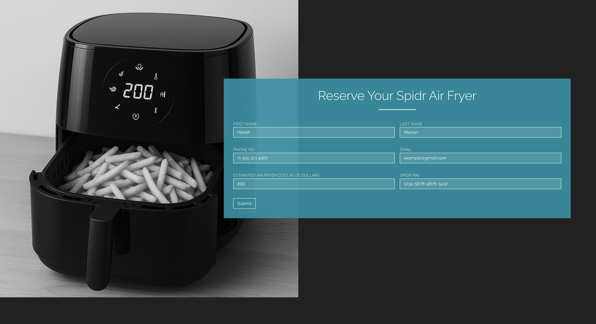
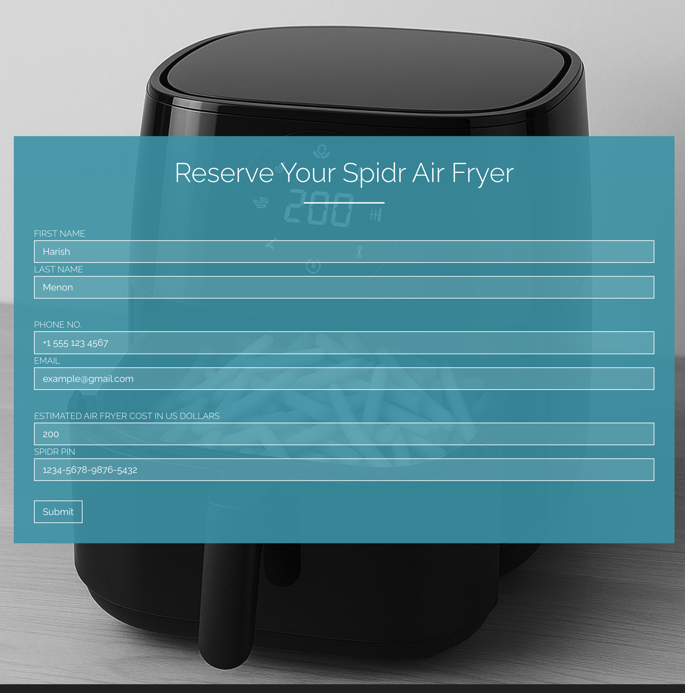

# Spidr Air Fryer Interest Form

A simple React app that contains a single-page form in the style of [Spidr Design's website](https://spidr.design/), built as a fictional interest form for their new air fryer.

## Form Fields

The form contains the following fields:

- First name
- Last name
- Phone number (format validated)
- Email address (format validated)
- Estimated Air Fryer's cost in US dollars (numbers only)
- Spidr PIN (16 digits, auto-formatted as `####-####-####-####`)

The **Submit** button prints the form data to the browser console and resets the form.

## Tech Stack

- **React** with `useState`
  - Regex-based input formatting (`onChange`)
  - Local image asset used as background
- **CSS** for layout, responsiveness, and Spidr-inspired styling
- **HTML** for form structure
- **Vite** for development
- **GitHub Pages** for deployment

## Design & Style

The form layout and styling aim to closely mimic the bold, expressive design language of Spidr Design.

### Desktop

- The background image fills the **left half** of the screen.
- A **translucent blue overlay** containing the form floats on the **right half**.

### Tablet

- The background image spans the **entire screen width**.
- The form overlay is centered **on top of the image**.

### Mobile

- The background image appears on the **bottom half** of the screen.
- The form is placed **above** the image.

Typography, border styling, and color choices were customized to reflect Spidr’s aesthetic: clean, high-contrast, and slightly unconventional. The font, Raleway (imported via Google Fonts), was chosen to match the look and feel of Spidr Design’s site.

## Live Demo

[View the form on GitHub Pages](https://classicracer.github.io/spidr-airfryer-form/)
